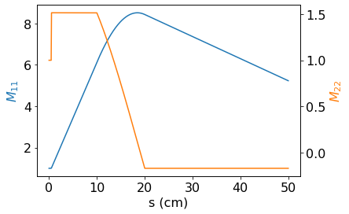

# BeLinear
Performant numerical solutions of the paraxial ray equation.

## Installation

Please install the package using pip.

```
pip install <unzipped belinear directory>
```

## Quickstart Guide

To calculate linear transfer matrices, you're going to need fieldmaps for all of the elements in your system.  We're going to pick up the script after you have already calculated the fields (Ez and Bz) along the axis of the beamline.  The fields and positions must be in SI units: MV/m, Tesla, and meters.  I'll be using the following fields as an examples.


The first step is to interpolate the fields onto a set of points which we will use in the numerical evaluation of the ODE.  The solver requires that the fields are interpolated on an evenly spaced set of points.  The number of points used here will determine the accuracy of the solution so be sure to use enough for your application.  See the section on convergence for a more detailed discussion of choosing the number of points.

Once we have the interpolated fields, we can make the call to the solver and get the transfer matrix.  The transfer matrix will be returned in [x, px] phase space as opposed to [x, x'] trace space which is common in accelerator physics.  This is done because the angle x' becomes ill-determined when particles have zero longitudinal momentum as is the case at the start of integration in guns.

```python
# Load belinear and numpy
import belinear
import numpy as np

# Compute the fields on axis (replace with your code)
z_raw  = np.linspace(0, 0.5, 1000)
Ez_raw = (z_raw<0.005)*10e3/5e-3
Bz_raw = np.bitwise_and(z_raw > 0.1, z_raw < 0.2) * 6e-3

# Interpolate to the points used in ODE solving
z       = np.linspace(z_raw.min(), z_raw.max(), 10000)
delta_z = z[1] - z[0]
Ez      = np.interp(z, z_raw, Ez_raw)
Bz      = np.interp(z, z_raw, Bz_raw)

# Calculate the linear transport matrix
M = belinear.get_M(Ez, Bz, delta_z)
```

Note: this will start the particles with no longitudinal velocity and so we require that Ez(z=0) != 0.  To start with non-zero longitudinal energy, set the appropriate option.

```python
# Calculate the linear transport matrix
M = belinear.get_M(Ez, Bz, delta_z. gamma_initial=2)
```

BeLinear also supports multiple ODE solvers.  We have been using the default option which is the midpoint method.  This is expected to the best option for most cases, however you may change which solver is used with the optional argument.

```python
# Calculate the linear transport matrix
M = belinear.get_M(Ez, Bz, delta_z. method='<method name>')
```

The solvers supported by BeLinear are:

* "midpoint" - The [midpoint rule or modified Euler's method](https://en.wikipedia.org/wiki/Midpoint_method) is a symplectic integrator with second order global convergence.  It shows excellent accuracy for Hamiltonian systems with a low number of steps and preserves the symplectic form.  This is the default option in BeLinear and shows the best convergence for regularly used field configurations.
* "implicit_euler" - This method is the well known [implicit Euler's method](https://en.wikipedia.org/wiki/Backward_Euler_method).  It's has first order global convergence and better stability than forwards Euler for some systems.
* "constant_field" - Adapted from the paper "Gulliford, C., & Bazarov, I. (2012).  PRAB, 15(2), 024002".  It iterates the solution to [x1'(z), x2'(z)] = [[A, B], [C, D]]*[x1(z), x2(z)] for values of A, B, C, and D computed from the fields.  That is, it assumes constant coefficients in the ODE, but not necesarily constant fields since the coefficients also depend on gamma which changes in the presence of constant E fields.

Belinear also support cummulative output of the transfer matrices as one big numpy array of shape (2,2,N).  This function has all the same options as the normal solver call.

```python
# Calculate the linear transport matrix with cumulative output
M_cum = belinear.get_M_cum(Ez, Bz, delta_z)
```

Plotting the matrix elements against position gives the following plot.



The final options for computing matrices revolve around finding the matrix "B" in the analysis of voltage scan data.  This is the nx2 matrix where the rows are M11^2 and M12^2 as the gun's voltage is varied.  There is a higher level wrapper function for the voltage scan called get_B which accepts a numpy array of voltages in the method, a filename to a tab delimited fieldmap of the anode, the position of the screen, and the number of steps to use in the solver.  See the reference section for more detail.

## Convergence Properties

To test the convergence properties run the solver with a smaller step size than you would reasonably use (h = 1e-7 m for instance) and use the output as a "ground truth" results of what the matrix should be.  Run the solver again for you system while changing the step size and monitor the error.  If your step size was small enough in the previous step then you see assymptotically power law convergence of the global error.  As an example, I have computed the global error vs step size for the field map at the top of the file and for the three solvers included in Belinear.  First off is the midpoint method.


From this you can immediately see the higher order convergence of the midpoint method and its superior error compared to the implicit Euler and constant-field methods.  The author has found that a good tradeoff between speed and accuracy for the analysis of low voltage guns is to use a step size of h = 10 um (about 1E4 steps inside of the gun). 

## Reference

##### get_M(Ez, Bz, delta_z, gamma_initial=1, method='midpoint')

Primary interface to the solver.  Please call this from user code to calculate the linear transport matrices from the fields Ez and Bz sampled at constant interval.  The number of steps used by the solver is just the number of field points passed to the method.

###### Parameters

* Ez: array_like
      The z component of the on-axis electric field in MV/m.  A (n,) shape array.
* Bz: array_like
      The z component of the on-axis magnetic field in Tesla.  A (n,) shape array.
* delta_z: float
      The spacing between samples of the field in meters
* gamma_initial: float
      The relativistic gamma factor of the beam at the start of the region of integration
* method: str
      Which ODE solver to use.  Options are "midpoint", "implicit_euler", or "constant_field"

###### Returns

* M: array_like
      The linear transport matrix in [x, px] phase space.  A (2,2) numpy array.

##### get_cum_M(Ez, Bz, delta_z, gamma_initial=1, method='midpoint')

The same solver function as "get_M" except that it will output the transfer matrices at every step as well as at the end.  Useful for plotting particle trajectories.

###### Parameters

* Ez: array_like
      The z component of the on-axis electric field in MV/m.  A (n,) shape array.
* Bz: array_like
      The z component of the on-axis magnetic field in Tesla.  A (n,) shape array.
* delta_z: float
      The spacing between samples of the field in meters
* gamma_initial: float
      The relativistic gamma factor of the beam at the start of the region of integration
* method: str
      Which ODE solver to use.  Options are "midpoint", "implicit_euler", or "constant_field"

###### Returns

* M_cum: array_like
      The transfer matrices in phase space ([x, px]) output at every step from the solver.  A (2,2,n)
      numpy array.

##### get_B(voltages, anode_map_filename, beamline_length, N=10000)

Computes the matrix "B" used in data analysis for the voltage scan method of calculating MTE.  Will likely be deprecated soon in favor of keeping this more application specific code in standalone voltage scan libraries

###### Parameters

* voltages: array_like
      The list of voltages in the scan
* anode_map_filename: str
      The anode fieldmap normalized so that the cathode is at 9 kV (an unfortunate legacy standard).
      The file should be tab delimited with the columns z and Ez.
* beamline_length: float
      The location of the final screen in meters.
* N: int
      The number of steps for the solver to take.

###### Returns

* B: array_like
      The matrix "B" for the voltage scan.  It's rows are [M11^2(V), M12^2(V)] for each voltage in the scan.
